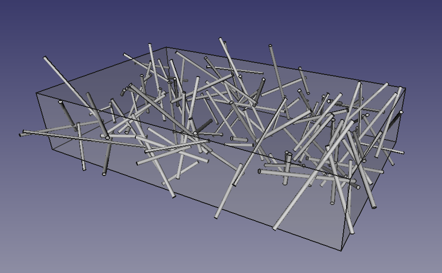
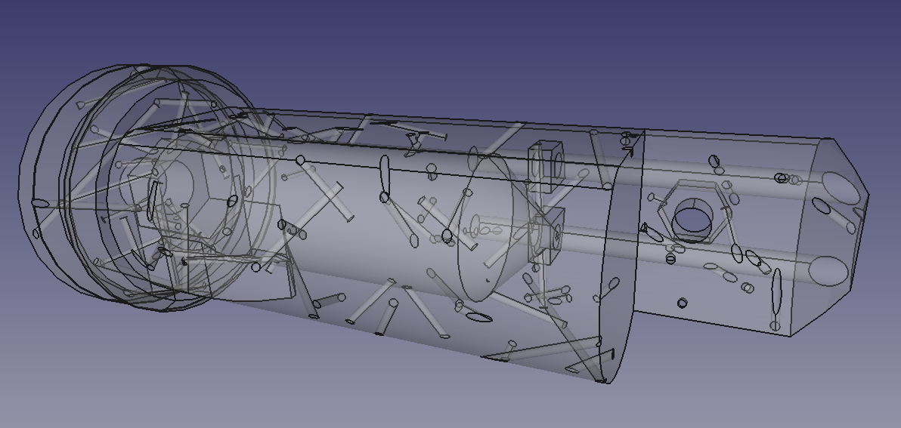
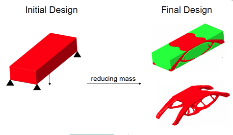
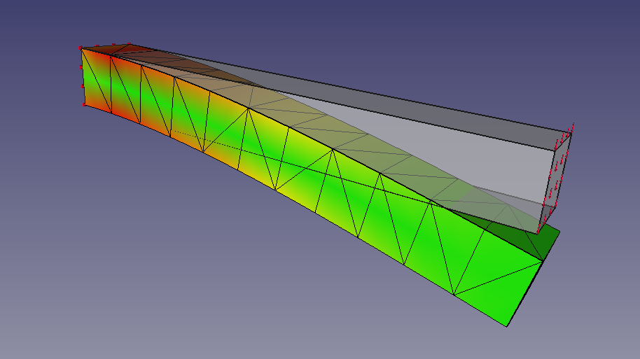
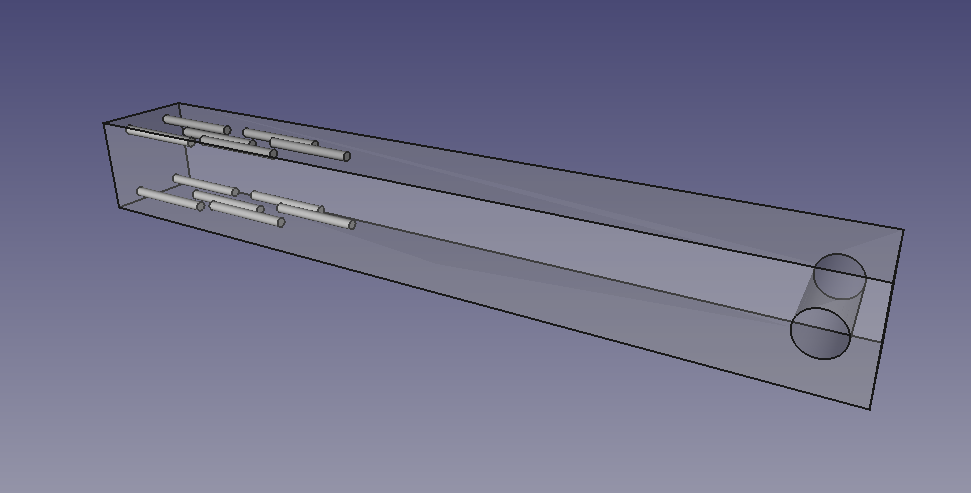
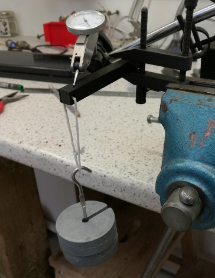
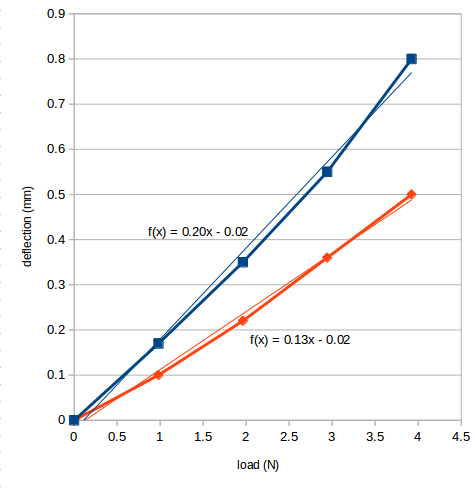

# Fibre

Making RepRap prints stronger without doing a lot of work.

The other day a tweet about filling the interior of RepRap prints with more plastic after the print is finished prompted me to look at an old idea of mine from 2005 for reinforcing prints with printed vertical columns (see http://blog.reprap.org/2005/06/strength-of-objects-made-by-layered.html).

It occurred to me that this could be generalised to make prints that acted like glass-fibre or carbon-fibre reinforced resin for extra strength.  Think about what happens if, in the CAD system, you subtract a thin cylinder (say 0.5mm in diameter) from the interior of a part to be printed.  When the part is sliced the slicer will surround the cylinder with solid material automatically, making it like a length of strong fibre embedded in a weaker material (the print's infill).

If you don't know anything about the stresses the part will be subjected to, but just want to make it generally stronger without setting the infill to 100%, you could just subtract a bunch of random cylinders from it and rely on the slicer and the printing process to make those cylinder 'fibres' automatically.  This would be rather like making the object from a resin composited with glass-fibre wool or random chop.

So I wrote a FreeCAD (https://www.freecadweb.org/) Python macro to generate the union of a load of random cylinders with their centres distributed in a pre-defined cuboid volume:

If the cuboid just surrounds the part you want to reinforce, then you just subtract the resulting cylinder pattern from it:

(The macro is in our Github repository: https://github.com/RepRapLtd/Fibre)  Of course, angled cylinders will be layered, but they should still be a lot stronger than infill.  Also, if your printer can handle two materials you could print the part out of a weaker material, and fill the cylinders with a stronger one.  I don't think it matters (except maybe for appearances) that some of the holes come to the surface.

There are quite a few systems that will take a CAD design, apply forces to it and work out the internal stresses using finite element analysis, and then erode regions with low stress and swell regions with high stress to optimise the shape of the design to give the strongest result with the lowest mass.  Here's an example:

But you may not want to change the original shape for aesthetic or other reasons.  You can still apply the internal reinforcing fibres idea to a print though.  Here's FreeCAD doing an FEA stress analysis of a simple rectangular beam encased at the left end, and weighed down at the right:

As you would expect, the maximum tensile and compressive stresses are at the top and bottom of the beam next to the encasement where the bending moment is greatest.  By hand I added some internal cylindrical voids in the regions of maximum stress (also a hole at the other end to hang a weight from):

Here is the experimental set-up.  I printed the beams 20mm longer (without any reinforcement in either extension) at the left hand end to give something to grasp.  They were held in a toolmaker's clamp and clocked-up with a dial gauge.  Weights were added on a loop of string [Bowyer's Law - all valid experiments must include at least one (1) length of string]:

And here are the results.  The beams were printed in PLA.  The blue line is the control beam with no reinforcement; the orange is the beam with the thin cylindrical voids:

The load-deflection curves are slightly non-linear as would be expected for plastics, which are not Hookean materials.  Simplifying to the least-squares-fit straight lines, the stiffness of the un-reinforced control beam is 5.0 N/mm, but the stiffness of the beam with the reinforcing cylindrical voids is 7.7 N/mm (those are the reciprocals of the graph gradients).  That's a 54% improvement.

Next I will write some code automatically to add reinforcing cylinders to regions where the FEA says there is high stress.  Of course, other shapes than cylinders could be used, like thin sheets, thin ellipsoids and so on, depending on the geometry of the part, and on the shapes and nature of the stresses.  Similarly material could be saved by subtracting larger shapes to make voids in regions of low stress.

